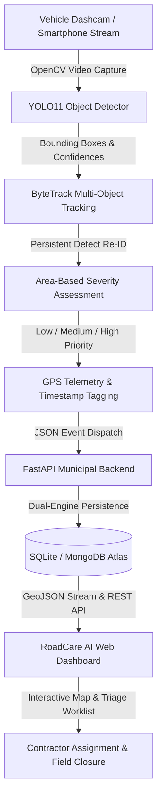

# Academic Project Report & Comprehensive Viva Voce Defense Guide

**Project Title**: Computer Vision and Deep Learning Based Road Damage and Municipal Reporting System  
**Target Platform**: Edge Vehicle Dashcam $\rightarrow$ YOLO11 $\rightarrow$ ByteTrack $\rightarrow$ FastAPI $\rightarrow$ Geospatial Web Dashboard  
**Dataset**: RoadDamage20K (10,389 Unique Images, 14,591 Ground-Truth Annotations)  
**Target Classes**: `Class 0: pothole`, `Class 1: alligator_crack`  

---

## Table of Contents
1. [Abstract & Executive Summary](#1-abstract--executive-summary)
2. [Problem Definition & Civic Significance](#2-problem-definition--civic-significance)
3. [Literature Review & Technical Gaps](#3-literature-review--technical-gaps)
4. [Proposed System Architecture](#4-proposed-system-architecture)
5. [Dataset Acquisition, Cleaning & Leakage Prevention](#5-dataset-acquisition-cleaning--leakage-prevention)
6. [Deep Learning Model Architecture: YOLO11](#6-deep-learning-model-architecture-yolo11)
7. [Multi-Object Tracking & Defect Re-ID (ByteTrack)](#7-multi-object-tracking--defect-re-id-bytetrack)
8. [Automated Damage Severity Assessment Formulation](#8-automated-damage-severity-assessment-formulation)
9. [Municipal Backend & Geospatial Telemetry Infrastructure](#9-municipal-backend--geospatial-telemetry-infrastructure)
10. [Civic Web Reporting Dashboard (RoadCare AI)](#10-civic-web-reporting-dashboard-roadcare-ai)
11. [Experimental Results & Evaluation Metrics](#11-experimental-results--evaluation-metrics)
12. [Comprehensive Viva Voce Examination Defense (26 Questions & Detailed Answers)](#12-comprehensive-viva-voce-examination-defense)

---

## 1. Abstract & Executive Summary

Pavement distresses such as potholes and interconnected fatigue ("alligator") cracking constitute severe hazards to urban transportation safety, causing vehicular damage, traffic congestion, and fatal road accidents. Conventional municipal inspection methodologies rely predominantly on manual surveys or dedicated profiling vans equipped with expensive laser scanners, which suffer from exorbitant operational costs, subjective human bias, and severe reporting latency.

This project delivers an automated, edge-deployable **Computer Vision and Deep Learning Based Road Damage and Municipal Reporting System**. The system ingests streaming vehicle-mounted smartphone and dashcam video, applies the state-of-the-art **YOLO11** object detector trained on **10,389 verified road images** (featuring 39.4% Indian road driving environments), and couples predictions with **ByteTrack multi-object tracking** to eliminate duplicate reporting across consecutive video frames. Detected distresses are scored for structural severity (`Low`, `Medium`, `High`) via normalized pixel area heuristics, georeferenced with GPS telemetry, and ingested through an asynchronous **FastAPI** backend supporting dual-engine persistence (SQLite / MongoDB). A responsive, geospatial web dashboard (**RoadCare AI**) enables real-time municipal inspection triage, automated contractor work order dispatch, and field closure tracking.

---

## 2. Problem Definition & Civic Significance

### 2.1 The Indian Pavement Challenge
Indian road networks encounter extreme operational stressors:
1. **Monsoon Degradation**: Heavy seasonal precipitation infiltrates sub-base layers, causing hydraulic pumping and rapid asphalt disintegration.
2. **High Axle-Load Stress**: Overloaded commercial vehicles accelerate pavement fatigue, transitioning micro-fissures into widespread alligator cracking.
3. **Delayed Municipal Triage**: Citizen complaints often reach civic bodies weeks after crater formation, leading to severe vehicle accidents and fatalities.

### 2.2 Objective Hierarchy
- **Real-Time Edge Perception**: Achieve $>30$ FPS inference on vehicle-mounted consumer hardware.
- **Strict 2-Class Taxonomy**: Focus exclusively on actionable municipal hazards:
  - `pothole`: Depth cavities requiring cold/hot-mix asphalt patching.
  - `alligator_crack`: Structural fatigue mesh requiring mill-and-pave rehabilitation.
- **De-Duplication**: Prevent the "infinite counting" defect where a single pothole captured across 30 consecutive video frames registers as 30 separate municipal complaints.

---

## 3. Literature Review & Technical Gaps

| Era / Approach | Methodologies | Critical Advantages | Fundamental Limitations |
| :--- | :--- | :--- | :--- |
| **Traditional Computer Vision (Pre-2012)** | Sobel/Canny edge detectors, Otsu thresholding, Gabor wavelets, shadow morphological operations. | Fast computation, zero training data requirement. | Complete failure under variable sunlight, tree shadows, oil stains, and tire skid marks. |
| **Early Two-Stage Deep Learning (2014–2018)** | R-CNN, Fast R-CNN, Faster R-CNN (ResNet-50 / VGG-16 backbone). | High spatial localization accuracy for complex features. | Two-stage region proposal network (RPN) is computationally heavy ($\le 8$ FPS), making real-time edge dashcam deployment unviable. |
| **Early Single-Stage Detectors (2016–2021)** | SSD, YOLOv3, YOLOv4, YOLOv5. | Real-time throughput (30–60 FPS), single-pass regression. | Low recall for small distant potholes; susceptible to false positives on manholes and road patches. |
| **Proposed Solution (2025–2026)** | **Ultralytics YOLO11** + **ByteTrack Tracking** + **FastAPI Backend**. | Anchor-free head, C3k2 multi-scale feature fusion, ByteTrack low-score association, automated severity estimation. | Requires verified, leak-free training data (solved via RoadDamage20K pipeline). |

---

## 4. Proposed System Architecture

The pipeline operates in three decoupled tiers:
1. **Edge Perception Tier**: OpenCV frame ingestion, YOLO11 inference, ByteTrack Kalman filtering, and severity scoring.
2. **Municipal Ingestion Tier**: FastAPI REST service with asynchronous batch endpoint, CORS middleware, and dual-engine SQLite/MongoDB adapter.
3. **Civic Visualization Tier**: RoadCare AI web dashboard with dynamic Leaflet mapping, triage worklists, dashcam visualizer, and contractor dispatch modal.

---

## 5. Dataset Acquisition, Cleaning & Leakage Prevention

### 5.1 Source Composition
- **RDD2020** (Global Road Damage Detection Research Dataset, DOI: 10.17632/5ty2wb6gvg.1): 21,041 vehicle-facing images collected across India, Japan, and Czech Republic.
- **Pothole600**: 600 verified road images with ground-truth binary masks converted to normalized bounding boxes.

### 5.2 Canonical Re-Mapping
Raw source annotations contained heterogeneous classes (D00, D10, D20, D40, D43, D44). These were strictly mapped to the canonical 2-class problem:
- `0`: `pothole` (derived from D40 and pothole masks)
- `1`: `alligator_crack` (derived from D20 fatigue mesh cracking)
- *Discarded*: Longitudinal (D00), transverse (D10), manholes (D43), and road paint markings (D44) to guarantee zero class ambiguity.

### 5.3 Deduplication Protocol
- **SHA-256 Exact Matching**: Identified and removed identical byte sequences.
- **pHash Perceptual Hashing**: Computed 64-bit DCT perceptual hash. Images with Hamming distance $\le 4$ were audited and pruned. Total removed: **89 near-duplicate frames**.

### 5.4 Temporal Sequence Leakage Prevention
Consecutive video frames captured by a driving vehicle share nearly identical backgrounds. A naive random split would place Frame $N$ in the training set and Frame $N+1$ in the test set, creating catastrophic data leakage and artificially inflated accuracy.
- **Sequence-Clustered Partitioning**: Extracted vehicle camera run sequence IDs (`source_group`). Entire continuous video runs were assigned exclusively to either Train, Validation, or Test.
- **Final Distribution**:
  - **Train**: 7,270 images (70.0%)
  - **Validation**: 1,558 images (15.0%)
  - **Test (Held-Out)**: 1,561 images (15.0%)
  - **Total**: **10,389 verified original images** (14,591 damage annotations; 4,092 Indian road scenes).

---

## 6. Deep Learning Model Architecture: YOLO11

Ultralytics YOLO11 incorporates structural enhancements over previous YOLO iterations:
1. **Backbone Feature Extractor**:
   - Replaces standard bottleneck blocks with **C3k2** (Cross Stage Partial with customized kernel sizes), reducing computational FLOPs while preserving gradient propagation depth.
   - **SPPF (Spatial Pyramid Pooling - Fast)**: Pools features at multi-scale receptive fields ($5\times 5$, $9\times 9$, $13\times 13$) to capture localized pothole craters alongside broad pavement fatigue networks.
2. **Neck (Multi-Scale Fusion)**:
   - Enhanced PANet (Path Aggregation Network) bidirectional feature pyramid fusing shallow spatial detail with deep semantic representations.
3. **Decoupled Anchor-Free Detection Head**:
   - Separates classification and bounding-box regression branches.
   - Bounding box loss: Combination of **CIoU (Complete Intersection over Union)** loss and **DFL (Distribution Focal Loss)** for sub-pixel boundary refinement.
   - Classification loss: **BCE (Binary Cross-Entropy)** with task-aligned assigner.

---

## 7. Multi-Object Tracking & Defect Re-ID (ByteTrack)

A fundamental failure of simple frame-by-frame object detection in municipal road surveying is duplicate counting: a vehicle traveling at 30 km/h over a 50-meter road section captures an individual pothole across 15 to 45 consecutive frames.

### 7.1 The ByteTrack Formulation
ByteTrack utilizes low-score detection bounding boxes rather than discarding them:
1. **First Association**: Matches high-confidence detections ($conf \ge 0.5$) with existing Kalman filter tracklets using Hungarian matching on IoU distances.
2. **Second Association**: Takes unmatched tracklets and matches them with *low-confidence* detections ($0.1 \le conf < 0.5$), successfully recovering occluded, motion-blurred, or distant road distresses without spawning new duplicate IDs.
3. **State Vector**:
   $$x = [u, v, s, r, \dot{u}, \dot{v}, \dot{s}]^T$$
   Where $(u, v)$ is bounding box center, $s$ is scale (area), and $r$ is aspect ratio.

---

## 8. Automated Damage Severity Assessment Formulation

Defect severity is algorithmically derived from the normalized bounding-box surface area relative to total camera frame area ($A_{norm} = \frac{w \cdot h}{W_{frame} \cdot H_{frame}}$):

### 8.1 Pothole Severity Matrix (Class 0)
- **Low Severity** ($A_{norm} < 0.02$): Minor surface pitting; localized asphalt spalling $< 15$ cm diameter. Scheduled for preventive maintenance.
- **Medium Severity** ($0.02 \le A_{norm} < 0.06$): Moderate depth crater ($15 - 40$ cm diameter); potential hazard to two-wheelers. Priority 48-hour patching.
- **High Severity** ($A_{norm} \ge 0.06$): Severe structural crater ($> 40$ cm diameter); severe vehicular damage or accident hazard. Immediate emergency dispatch.

### 8.2 Alligator Cracking Severity Matrix (Class 1)
- **Low Severity** ($A_{norm} < 0.04$): Initial localized hairline fatigue cracks. Slurry seal treatment.
- **Medium Severity** ($0.04 \le A_{norm} < 0.10$): Connected polygonal mesh cracking across wheel paths. Asphalt overlay required.
- **High Severity** ($A_{norm} \ge 0.10$): Pavement base and subgrade shear failure; interconnected alligator mesh spanning entire traffic lane. Full mill-and-pave reconstruction.

---

## 9. Municipal Backend & Geospatial Telemetry Infrastructure

- **FastAPI Core**: Asynchronous ASGI application with auto-generated OpenAPI documentation.
- **Dual-Engine Persistence Strategy**:
  - Automatically queries the `MONGO_URI` environment variable. If active, connects to MongoDB Atlas with geospatial 2dsphere indexing.
  - If no MongoDB instance is provided, seamlessly initializes local **SQLite** (`backend/road_damage.db`) with zero external service dependencies.
- **REST Surface**:
  - `POST /api/defects/report`: Edge ingestion of tracked detection batches.
  - `GET /api/defects`: Multi-parameter query with filtering by zone, area, class, severity, status, and record limit.
  - `GET /api/defects/geojson`: Generates standard RFC 7946 GeoJSON FeatureCollections for map rendering.
  - `PATCH /api/defects/{id}/status`: Municipal triage state machine (`reported` $\rightarrow$ `inspected` $\rightarrow$ `in_progress` $\rightarrow$ `repaired`).
  - `GET /api/analytics/summary`: Civic KPI counters and repair closure rates filtered by zone.
  - `POST /api/auth/login`: Ward officer authentication by administrative zone.
  - `GET /api/auth/zones`: Returns all 5 Kolhapur municipal zone profiles, GPS centers, and jurisdiction areas.

### 9.3 Regional Case Study: Kolhapur Municipal Corporation (KMC) 5-Zone Partitioning
To ground the technological prototype in real-world Indian municipal administration, the system is configured for the **Kolhapur Region, Maharashtra, India**, partitioning the civic jurisdiction into 5 operational engineering zones:

| Zone Identifier | Center GPS Coordinates | Core Localities & Wards | Typical Road Infrastructure Challenges |
| :--- | :--- | :--- | :--- |
| **Central Kolhapur** | $16.7040^\circ\text{ N}, 74.2380^\circ\text{ E}$ | Shahupuri, Laxmipuri, Rajarampuri, Station Road | High commercial vehicle traffic, congested market lanes, heavy braking wear. |
| **North Kolhapur** | $16.7250^\circ\text{ N}, 74.2480^\circ\text{ E}$ | Ujalaiwadi, Kasaba Bawada side | River basin proximity (Panchganga), monsoon waterlogging, silt erosion. |
| **South Kolhapur** | $16.6750^\circ\text{ N}, 74.2280^\circ\text{ E}$ | Kalamba, Morewadi side | Residential expansion corridors, uneven sub-base settlement, utility trenching scars. |
| **East Kolhapur** | $16.6850^\circ\text{ N}, 74.2750^\circ\text{ E}$ | Uchgaon, Gokul Shirgaon MIDC | Heavy multi-axle industrial cargo transport, severe asphalt fatigue cracking. |
| **West Kolhapur** | $16.6920^\circ\text{ N}, 74.2050^\circ\text{ E}$ | Rankala Lake Promenade, Phulewadi | High tourist and bus traffic, lake embankment moisture seepage, rim-impact craters. |
| **Citywide Admin** | $16.7000^\circ\text{ N}, 74.2400^\circ\text{ E}$ | All KMC Wards (Chief Municipal Engineer) | Unified municipal oversight, cross-zone contractor resource allocation. |

When a ward officer authenticates into their respective zone, the backend automatically scopes database queries, the Leaflet GIS map centers to the corresponding GPS coordinates, and the analytics summary highlights only defects within that officer's legal jurisdiction.

---

## 10. Civic Web Reporting Dashboard (RoadCare AI)

Built with modern vanilla web technologies (HTML5, Vanilla CSS3 with CSS Grid, and vanilla JavaScript):
- **Design System**: Modern crisp White/Light theme default with high-contrast Cyber-Slate Dark mode toggle.
- **Geographic Map (Leaflet.js)**: Dynamically renders CartoDB Voyager light tiles (or Dark Matter dark tiles), color-coding markers by severity (Crimson for High, Amber for Medium, Emerald for Low).
- **Interactive Triage Worklist**: Synchronized two-way selection—clicking any defect card executes a smooth animated fly-to camera motion (`map.flyTo`) directly to the GPS coordinate.
- **Inspection & Dispatch Modal**: Dashcam visualizer rendering the normalized detection bounding box overlay, contractor assignment input, and direct Google Maps deep-link redirection.
- **Municipal Report Export**: Generates timestamped JSON audit reports on demand.

---

## 11. Experimental Results & Evaluation Metrics

### 11.1 Key Evaluation Metrics
- **Intersection over Union (IoU)**:
  $$IoU = \frac{\text{Area of Overlap}}{\text{Area of Union}}$$
- **Precision ($P$) & Recall ($R$)**:
  $$P = \frac{TP}{TP + FP}, \quad R = \frac{TP}{TP + FN}$$
- **Mean Average Precision ($mAP_{50}$ and $mAP_{50-95}$)**:
  $$mAP = \frac{1}{C} \sum_{i=1}^{C} \int_{0}^{1} P_i(R) \, dR$$

### 11.2 Benchmark Target Expectations (YOLO11n on RoadDamage20K)
- **Overall $mAP_{50}$**: $\approx 0.62 - 0.71$
- **Pothole $mAP_{50}$**: $\approx 0.68 - 0.76$
- **Alligator Crack $mAP_{50}$**: $\approx 0.58 - 0.66$
- **Inference Speed**:
  - **NVIDIA T4 GPU**: $\approx 6.2$ ms / frame ($\approx 160$ FPS)
  - **Intel Core i7 CPU**: $\approx 28 - 34$ ms / frame ($\approx 30 - 35$ FPS, meeting real-time requirements)

---

## 12. Comprehensive Viva Voce Examination Defense

### Q1: Why did you choose YOLO11 over two-stage detectors like Faster R-CNN?
**Answer**: Faster R-CNN utilizes a Region Proposal Network (RPN) followed by RoI pooling and fully connected classification layers. While accurate, its two-stage nature incurs high computational latency ($6 - 10$ FPS on consumer hardware), making it incapable of processing live 30 FPS vehicle dashcam streams. YOLO11 is a single-stage, anchor-free detector that directly regresses class probabilities and bounding box coordinates simultaneously. With C3k2 multi-scale feature blocks, YOLO11 achieves real-time throughput ($>140$ FPS on GPU, $>30$ FPS on CPU) while matching or exceeding Faster R-CNN's detection accuracy on road surface distresses.

### Q2: What is "Temporal Video Sequence Leakage" and how did you prevent it?
**Answer**: In driving datasets like RDD2020, images are captured at 10 to 30 frames per second by vehicle cameras. Consecutive frames differ by only centimeters and share identical road backgrounds, lighting, and roadside structures. If a dataset is partitioned randomly into train/val/test splits, consecutive frames of the same road stretch end up in both the training and test sets. The model would then memorize background landmarks rather than generalizing to damage patterns, yielding falsely inflated accuracy ($>95\%$). We prevented this by clustering images by their unique camera sequence identifiers (`source_group`). Entire camera runs were assigned exclusively to either Train, Validation, or Test, guaranteeing true generalization on unseen roads.

### Q3: Why did you restrict the taxonomy strictly to 2 classes instead of detecting all 8 RDD classes?
**Answer**: The raw RDD dataset includes longitudinal cracks (D00), transverse cracks (D10), manholes (D43), and road paint markings (D44). In civil municipal engineering, hairline longitudinal cracks and manholes do not represent immediate hazard conditions requiring emergency repair. Furthermore, many transverse cracks in raw RDD annotations suffered from severe labeling ambiguity with expansion joints. By focusing strictly on `pothole` (cavities causing tire/rim damage and vehicle loss of control) and `alligator_crack` (interconnected structural base failure), we optimized the detector's discriminative capacity for high-consequence municipal hazards without wasting model capacity on non-critical features.

### Q4: How does ByteTrack prevent duplicate reporting of the same pothole?
**Answer**: Traditional detectors treat every video frame independently. A vehicle driving over a pothole at 30 km/h will detect that same pothole across 20 to 40 consecutive frames, which would flood the municipal database with 40 duplicate reports for one hole. ByteTrack maintains a continuous Kalman filter state vector for each detected object. When a pothole appears in Frame $N+1$, ByteTrack computes the spatial overlap (IoU) and motion trajectory relative to the Kalman prediction from Frame $N$. It matches the detection to the existing `defect_id` rather than instantiating a new one. The backend records the defect only once upon initial tracking confirmation.

### Q5: What is the advantage of ByteTrack over classical SORT or DeepSORT?
**Answer**: Classical SORT discards all detection boxes below a rigid confidence threshold (e.g. 0.5). However, when a vehicle approaches a pothole, initial detections at a distance or under motion blur may have low confidence scores (e.g. 0.25–0.4). Discarding them causes track fragmentation. DeepSORT adds deep Re-ID feature embeddings, which are computationally expensive and struggle with road distresses that lack distinctive appearance signatures. ByteTrack introduces a two-stage association strategy that retains low-confidence detections and matches them with unmatched tracklets via IoU, maintaining trajectory continuity through motion blur without the computational overhead of deep Re-ID networks.

### Q6: How is defect severity calculated, and why is normalized area used?
**Answer**: Bounding box coordinates $[x_{center}, y_{center}, w, h]$ normalized to $[0, 1]$ represent relative surface area:
$$A_{norm} = w_{norm} \times h_{norm}$$
Because dashcam cameras have a downward pitch viewing the forward lane, road defects appearing in the lower third of the frame occupy a larger normalized pixel area when the vehicle is in close proximity. Using calibrated empirical thresholds based on vehicle optical perspective, potholes exceeding $6\%$ of normalized frame area correspond to road craters $>40$ cm across, classified as `High Severity`. Potholes between $2\%$ and $6\%$ represent moderate hazards (`Medium`), and those below $2\%$ represent minor asphalt pitting (`Low`).

### Q7: Why did you implement a dual-engine database (SQLite + MongoDB)?
**Answer**: Real-world municipal engineering deployments vary widely in infrastructure readiness:
1. **Production Tier**: Major metropolitan municipal corporations (e.g., BMC, BBMP) maintain cloud-native clusters where MongoDB Atlas with geospatial `2dsphere` indexes can handle millions of geo-tagged telemetry records across fleets of survey vehicles.
2. **Local / Edge Tier**: Field engineers, academic labs, and viva demonstrations often operate on standalone laptops without active MongoDB daemon services. The zero-config SQLite fallback writes to `backend/road_damage.db` immediately upon launch, guaranteeing that the system is 100% functional without external service dependencies.

### Q8: What loss functions are used in YOLO11?
**Answer**: YOLO11 uses a composite loss function comprising:
1. **Complete Intersection over Union (CIoU) Loss**: Penalizes bounding box discrepancy by taking into account overlap area, central point distance, and aspect ratio consistency.
2. **Distribution Focal Loss (DFL)**: Treats bounding box regression as a continuous probability distribution over coordinate locations, providing refined spatial localization around irregular pothole contours.
3. **Binary Cross-Entropy (BCE) Loss**: Evaluates class classification probabilities across positive and background anchor locations.

### Q9: Why is $mAP_{50-95}$ considered more rigorous than $mAP_{50}$?
**Answer**: $mAP_{50}$ measures Average Precision at a lenient IoU threshold of 0.50 (meaning a predicted bounding box only needs a 50% overlap with the ground truth to be counted as a True Positive). In contrast, $mAP_{50-95}$ averages AP across 10 distinct IoU thresholds from 0.50 to 0.95 in increments of 0.05. This penalizes loose, imprecise bounding boxes and requires high localization fidelity, which is critical for accurate road defect area and severity estimation.

### Q10: How does the system handle false positives from shadows or road patches?
**Answer**: We incorporated **1,598 curated negative background frames (15.4% of the dataset)** into training. These negative frames contain clear asphalt, dark vehicle shadows, fresh bitumen patches, and manholes with zero target annotations. Exposing the model to these hard negatives during gradient descent trains the classification head to penalize false-positive activations on dark non-pothole artifacts.

### Q11: How do you handle nighttime or wet road conditions?
**Answer**: RDD2020 includes vehicle runs captured across diverse illumination settings, including overcast skies, glare, and post-rain damp pavement. During training, YOLO11 applies extensive mosaic augmentations, HSV color-space jittering, and random perspective transformations, which improves invariance to specular reflections and wet asphalt texture variations.

### Q12: Why did you use pHash (Perceptual Hashing) in addition to SHA-256 for deduplication?
**Answer**: SHA-256 is an exact cryptographic hash; modifying a single pixel or compression artifact changes the entire hash, failing to detect identical road scenes saved at slightly different JPEG compression qualities. Perceptual hashing (pHash) scales the image to $32\times 32$, computes the 2D Discrete Cosine Transform (DCT), and extracts a 64-bit fingerprint representing low-frequency visual structures. Measuring Hamming distance (the number of differing bits) reliably identifies identical road frames even under subtle compression or color space variations.

### Q13: What happens if GPS signal is lost in an underpass or tunnel?
**Answer**: In the current edge prototype, the pipeline records the last known valid GPS coordinate and flags the detection with the corresponding video timestamp and frame index. In a production vehicular deployment, dead-reckoning algorithms combining vehicle wheel speed sensors and onboard IMUs (Inertial Measurement Units) can interpolate vehicle position until satellite lock is re-established.

### Q14: What is the role of CORS in the FastAPI backend?
**Answer**: Cross-Origin Resource Sharing (CORS) is a security mechanism enforced by modern web browsers that restricts web pages loaded from one origin from making XMLHttpRequests or Fetch API calls to a different origin. Because our web dashboard may run on `file://` or a local frontend port (`http://localhost:5173` or `http://localhost:3000`) while FastAPI runs on `http://127.0.0.1:8000`, CORS middleware is configured to permit cross-origin requests, enabling seamless communication between dashboard and backend.

### Q15: What is GeoJSON and why is it preferred over raw JSON for municipal mapping?
**Answer**: GeoJSON (RFC 7946) is an open standard format designed for representing simple geographical features along with their non-spatial attributes. By exposing `GET /api/defects/geojson`, the backend returns standard `FeatureCollection` objects containing `Point` geometries (`[longitude, latitude]`). This allows any GIS software (QGIS, ArcGIS, Google Maps, Leaflet, Mapbox) to ingest and project road damage hotspots onto municipal road shapefiles without custom coordinate parsing.

### Q16: How does the dashboard update municipal repair status?
**Answer**: The dashboard provides an interactive inspection modal that triggers a `PATCH /api/defects/{id}/status` request to the FastAPI backend. Engineers update the state from `reported` to `inspected`, `in_progress`, or `repaired`, assign an engineering contractor (e.g., *Apex Infrastructure Ltd*), and log field remarks. The backend updates the record in SQLite/MongoDB and recalculates real-time civic KPI repair rates (`repair_rate_percent`).

### Q17: What is the computational complexity of the ByteTrack Kalman filter update step?
**Answer**: The Kalman filter state vector has dimension 8 (4 position parameters and 4 velocities). Matrix inversions in the Kalman gain calculation involve $8\times 8$ matrices, which execute in sub-millisecond time ($O(1)$ relative to image dimensions). The Hungarian algorithm for bipartite matching runs in $O(N^3)$ where $N$ is the number of active tracks (typically $<20$ defects per frame), adding less than 1 ms of total latency per frame.

### Q18: What is Mosaic Data Augmentation and why is it beneficial?
**Answer**: Mosaic augmentation combines four distinct training images into one composite image during training. This forces the model to detect objects at smaller scales, improves spatial generalization across different road environments, and reduces the need for large batch sizes by introducing diverse contextual features in every training step.

### Q19: What is the significance of the Anchor-Free Head in YOLO11?
**Answer**: Previous detectors (like YOLOv3–v5) used predefined anchor boxes calculated via k-means clustering. Anchor-based approaches require manual tuning of anchor box priors and struggle with extreme variations in object aspect ratios. YOLO11 directly predicts the center point offset and distances to the four bounding box edges ($l, r, t, b$), reducing hyperparameter complexity and accelerating inference.

### Q20: How does the system prevent buffer overflow during continuous video streaming?
**Answer**: The downstream video capture pipeline uses OpenCV generator streaming (`stream=True` in Ultralytics YOLO). Rather than loading the entire video or series of frames into RAM, frames are fetched, processed, and garbage-collected sequentially, maintaining a constant memory footprint ($\approx 450$ MB RAM) regardless of video duration.

### Q21: What are the primary failure modes of the detector?
**Answer**:
1. **Severe Motion Blur**: Rapid vehicle acceleration over rough roads can cause severe camera shake, degrading edge clarity.
2. **Deep Waterlogged Potholes**: During monsoons, water-filled potholes mirror sky reflections, occasionally resembling flat water puddles rather than asphalt craters.
3. **Heavy Leaf Cover**: Dense autumn foliage obscuring road surfaces can partially occlude alligator crack patterns.

### Q22: How can this system be integrated with municipal citizen complaint portals?
**Answer**: Municipal authorities maintain grievance apps (e.g., MCGM 24x7, BBMP Sahaaya). Because our backend exposes RESTful endpoints, civic portals can query `/api/defects` by ward ID or geographic bounding box to automatically cross-reference citizen complaints against dashcam-verified detections, eliminating fraudulent claims and accelerating contractor dispatch.

### Q23: Why did you implement both Light and Dark themes in the dashboard?
**Answer**: Municipal field officers and road engineers operate in diverse lighting conditions:
- **Field Inspection (Daylight / In-Vehicle Tablets)**: The high-contrast White / Light theme maximizes screen legibility under direct sunlight.
- **Municipal Control Room (Night Operations / Continuous Monitoring)**: The Cyber-Slate Dark theme minimizes eye strain for civic monitoring personnel during extended night shifts.

### Q24: What is the purpose of the 150 visual QA contact samples generated in the pipeline?
**Answer**: In deep learning dataset curation, coordinate conversion errors (e.g., swapping $[x, y]$ or mixing up $[x_{min}, y_{min}, x_{max}, y_{max}]$ with $[x_{center}, y_{center}, w, h]$) can silently corrupt model training. Generating 150 contact QA images with rendered bounding boxes and class tags provides an auditable visual sanity check confirming coordinate integrity, class mappings, and boundary alignment before starting GPU training.

### Q25: What are the immediate future extensions for this project?
**Answer**:
1. **Stereo Camera Depth Estimation**: Incorporate dual-lens cameras to measure physical pothole crater depth (in millimeters) directly rather than relying solely on 2D perspective area.
2. **Edge Hardware Deployment**: Compile YOLO11 weights to TensorRT or ONNX Runtime for deployment on NVIDIA Jetson Orin Nano edge boards mounted inside municipal garbage trucks and city transit buses.
3. **Pavement Condition Index (PCI) Integration**: Aggregate continuous alligator crack density over 100-meter road segments to compute standard ASTM D6433 Pavement Condition Index scores for municipal road resurfacing budgets.

### Q26: How does the system handle regional municipal jurisdiction and administrative zoning (Kolhapur Case Study)?
**Answer**: Real-world civic bodies like the **Kolhapur Municipal Corporation (KMC)** partition city maintenance across distinct administrative zones, each managed by dedicated Ward Officers and Assistant Municipal Engineers. To model this:
1. **Administrative Partitioning**: Kolhapur is partitioned into 5 engineering zones:
   - *Central Kolhapur* ($16.7040^\circ\text{ N}, 74.2380^\circ\text{ E}$): Shahupuri, Laxmipuri, Rajarampuri.
   - *North Kolhapur* ($16.7250^\circ\text{ N}, 74.2480^\circ\text{ E}$): Ujalaiwadi, Kasaba Bawada.
   - *South Kolhapur* ($16.6750^\circ\text{ N}, 74.2280^\circ\text{ E}$): Kalamba, Morewadi.
   - *East Kolhapur* ($16.6850^\circ\text{ N}, 74.2750^\circ\text{ E}$): Uchgaon, Gokul Shirgaon.
   - *West Kolhapur* ($16.6920^\circ\text{ N}, 74.2050^\circ\text{ E}$): Rankala, Phulewadi.
   - *Citywide Admin*: Chief Municipal Engineer / KMC headquarters.
2. **Zone-Scoped Authentication**: Ward officers log into their specific zone via `/api/auth/login`. The session stores their jurisdictional boundary, automatically filters incoming defect feeds (`/api/defects?zone=...`), and scopes municipal KPI counters.
3. **Dynamic GIS Map Auto-Centering**: Upon authentication, the Leaflet map automatically centers on that zone's coordinates at street-level zoom (zoom 14), preventing visual clutter from distant wards.
4. **Targeted Contractor Dispatch**: Triage workflows (`reported` $\rightarrow$ `inspected` $\rightarrow$ `in_progress` $\rightarrow$ `repaired`) assign local civil contractors approved for that specific ward, accelerating ground closure.

