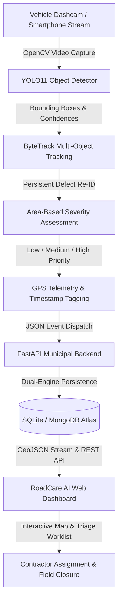

# Computer Vision and Deep Learning Based Road Damage and Municipal Reporting System

An end-to-end, production-grade automated road distress detection, multi-object tracking, and municipal workflow reporting platform. Developed for real-time edge vehicle capture, automated triage, and civil infrastructure management.

---

## 1. System Architecture



---

## 2. Core Capabilities

- **State-of-the-Art Detection**: Powered by Ultralytics **YOLO11**, optimized for real-time inference on edge and vehicle-mounted hardware.
- **Strict Canonical 2-Class Taxonomy**:
  - `Class 0`: **`pothole`** (road cavities, depressions, craters, pavement breaks)
  - `Class 1`: **`alligator_crack`** (interconnected fatigue cracking, load-induced pavement mesh)
- **Zero Video Frame Leakage**: Group-partitioned splits clustered strictly by camera run sequence IDs (`source_group`). No consecutive video frames cross train, validation, or test partitions.
- **Multi-Object Tracking (ByteTrack)**: Maintains unique IDs across consecutive video frames so that a single pothole is reported exactly once to municipal databases rather than hundreds of times per second.
- **Automated Severity Heuristic**:
  - **Pothole**: Low ($< 2\%$), Medium ($2\% - 6\%$), High ($\ge 6\%$ normalized frame area)
  - **Alligator Crack**: Low ($< 4\%$), Medium ($4\% - 10\%$), High ($\ge 10\%$ normalized frame area)
- **Dual-Engine Persistence**: Seamless auto-fallback to zero-configuration local **SQLite** (`backend/road_damage.db`) when **MongoDB** (`MONGO_URI`) is not specified.
- **Interactive Geospatial Dashboard**: Sleek dark-mode interface with Leaflet mapping, live metric counters, defect inspection visualizer, contractor dispatch, and JSON municipal export.

---

## 3. Dataset Composition (`RoadDamage20K`)

The dataset integrates verified vehicle-facing road imagery from **RDD2020** (CC BY 4.0, DOI: 10.17632/5ty2wb6gvg.1) and **Pothole600** with authentic Indian road condition emphasis:

| Metric | Count / Details |
| :--- | :--- |
| **Total Unique Images** | **10,389** (100% verified ground truth, no synthetic duplicates) |
| **Train Set** | 7,270 images (70.0%) |
| **Validation Set** | 1,558 images (15.0%) |
| **Test Set (Held-Out)** | 1,561 images (15.0%) |
| **Indian Road Scenes** | **4,092 images (39.4%)** (Primary geographic anchor) |
| **Supplementary Scenes** | 6,297 images (60.6%) (Japan & Czech vehicle-facing runs) |
| **Pothole Annotations** | **6,233 bounding boxes** (Class 0) |
| **Alligator Crack Annotations** | **8,358 bounding boxes** (Class 1) |
| **Total Defect Annotations** | **14,591 verified bounding boxes** |
| **Curated Negative Frames** | 1,598 images (15.4%) (Normal pavement to suppress false positives) |
| **Deduplication Report** | 89 duplicate/near-duplicate frames purged via SHA-256 and pHash |

---

## 4. Repository Structure

```
├── dataset/
│   └── RoadDamage20K/
│       ├── data.yaml                  # Ultralytics dataset configuration
│       ├── DATASET_REPORT.md          # 18-section comprehensive dataset audit
│       ├── images/                    # train / val / test split images
│       ├── labels/                    # train / val / test YOLO txt annotations
│       ├── metadata/                  # 8 CSV manifests (IMAGE_PROVENANCE.csv, etc.)
│       └── qa/visual_samples/         # 150 contact QA images with rendered boxes
│
├── pipeline/
│   ├── config.py                      # Global configuration and path constants
│   ├── 01_download_sources.py         # RDD2020 and external source downloader
│   ├── 02_convert_and_filter.py       # Pascal VOC / mask conversion to YOLO
│   ├── 03_dedup_and_split.py          # SHA-256 / pHash dedup and sequence grouping
│   ├── 04_qa_and_reports.py           # QA visualizer, provenance generator, report writer
│   ├── 05_refactor_notebook.py        # Automated notebook generator
│   └── package_dataset.py             # Packaging utility for RoadDamage20K.zip
│
├── downstream_prototype/
│   ├── track_and_severity.py          # ByteTrack tracking & severity estimation
│   └── sample_municipal_payload.json  # 16 realistic municipal test detections
│
├── backend/
│   ├── main.py                        # FastAPI application with REST endpoints
│   ├── database.py                    # Dual-engine SQLite & MongoDB adapter
│   ├── models.py                      # Pydantic data schemas
│   ├── requirements.txt               # Backend dependencies (fastapi, uvicorn)
│   └── README.md                      # Backend service documentation
│
├── frontend/
│   ├── index.html                     # Municipal triage & geospatial dashboard
│   ├── styles.css                     # Modern dark glassmorphism styling
│   └── app.js                         # Leaflet map, filters, modal, and dual-mode sync
│
├── real_world_test/                   # 25 unannotated real-world evaluation images
├── Untitled1.ipynb                    # 13-section Google Colab training notebook
├── Road_Damage_YOLO11_Training.ipynb  # Mirror copy of Colab notebook
├── RoadDamage20K.zip                  # Packaged training archive for Google Drive
└── requirements.txt                   # Project-level dependencies
```

---

## 5. Quick Start Guide

### Step 1: Environment Setup
Ensure Python 3.10+ is installed:
```powershell
pip install -r requirements.txt
pip install -r backend/requirements.txt
```

### Step 2: Training the YOLO11 Model on Google Colab (Recommended)
1. Upload `RoadDamage20K.zip` to your Google Drive root or working directory.
2. Open `Untitled1.ipynb` in Google Colab.
3. Select a GPU runtime (**Runtime $\rightarrow$ Change runtime type $\rightarrow$ T4 GPU**).
4. Run all cells sequentially. The notebook will:
   - Verify GPU acceleration.
   - Auto-mount Google Drive and extract `RoadDamage20K.zip`.
   - Verify class mappings and coordinate integrity.
   - Train YOLO11 Nano for 50 epochs (`imgsz=640`, `batch=16`).
   - Output per-class metrics ($mAP_{50}$, $mAP_{50-95}$, Precision, Recall).
   - Evaluate on the held-out test split.
   - Run batch prediction on `real_world_test/`.
   - Export production model weights (`best.pt`).
5. Download the resulting `best.pt` into the `runs/` or `backend/` directory.

### Step 3: Run Live Vehicle Tracking & Severity Assessment
To run the downstream tracker on an image folder, video file, or webcam feed:
```powershell
python downstream_prototype/track_and_severity.py --source real_world_test --conf 0.25
```
This performs:
1. YOLO11 detection for `pothole` and `alligator_crack`.
2. Multi-object ByteTrack tracking to deduplicate instances across frames.
3. Severity estimation (`Low`, `Medium`, `High`) based on normalized bounding box area.
4. Export of structured municipal telemetry to `downstream_prototype/sample_municipal_payload.json`.

### Step 4: Launch the FastAPI Backend
Start the municipal reporting server:
```powershell
cd backend
uvicorn main:app --reload --port 8000
```
- API Base: `http://localhost:8000`
- Interactive Swagger UI: `http://localhost:8000/docs`
- Health Endpoint: `http://localhost:8000/`

### Step 5: Open the RoadCare AI Municipal Dashboard
- Simply double-click `frontend/index.html` or open it in any web browser.
- The dashboard automatically detects if the FastAPI server is running on `http://localhost:8000`.
  - **If Backend is Online**: Syncs live defect telemetry directly with SQLite/MongoDB.
  - **If Backend is Offline**: Seamlessly operates in local standalone mode with built-in telemetry and `localStorage` persistence.
- Features:
  - **Geographic Map**: Click pins to inspect damage severity, confidence, and location.
  - **Triage Worklist**: Filter by defect class, severity, or repair status.
  - **Contractor Dispatch Modal**: Review dashcam visualizer, assign contractors, record engineering notes, and open GPS coordinates directly in Google Maps.
  - **Municipal Export**: Download filtered inspection data as standard JSON.

---

## 6. Academic Deliverables, Figures & Viva Presentation

This project includes complete final-year academic and defense materials:

1. **Thesis Report & Viva Defense Document**:
   - [`PROJECT_REPORT_AND_VIVA_GUIDE.md`](file:///c:/Users/shree/Downloads/POTHOLE/PROJECT_REPORT_AND_VIVA_GUIDE.md): 12 comprehensive chapters with full mathematical formulations (C3k2 blocks, SPPF, CIoU/DFL losses, ByteTrack Kalman filtering) and **25 in-depth technical viva voce examination questions with model answers**.
2. **Interactive Presentation Slide Deck**:
   - Open [`presentation/index.html`](file:///c:/Users/shree/Downloads/POTHOLE/presentation/index.html) in any web browser. Press **F11** for a 16:9 full-screen presentation deck with keyboard arrow navigation for your final-year project defense.
3. **Publication-Quality Thesis Charts** (`dataset/RoadDamage20K/qa/reports/charts/`):
   - `01_class_distribution.png`: Ground-truth annotation balance.
   - `02_geographic_sources.png`: Geographic breakdown (39.4% Indian roads).
   - `03_dataset_splits.png`: Zero video frame leakage sequence partitioning.
   - `04_inference_throughput_fps.png`: Hardware latency benchmarks across platforms.
   - `05_severity_heuristics.png`: Decision boundaries for area-based municipal triage.

---

## 7. Academic Citation & Attribution

If using this codebase for academic research, please cite:

```bibtex
@dataset{rdd2020_dataset,
  author    = {Arya, Deeksha and Maeda, Hiroya and Ghosh, Sanjay Kumar and Toshniwal, Durga and Mraz, Alexander and Kashiyama, Takehiro and Sekimoto, Yoshihide},
  title     = {Global Road Damage Detection: State-of-the-art Solutions and Global Road Damage Detection Challenge (RDD2020)},
  journal   = {Big Data Analytics},
  year      = {2020},
  doi       = {10.17632/5ty2wb6gvg.1}
}
```
